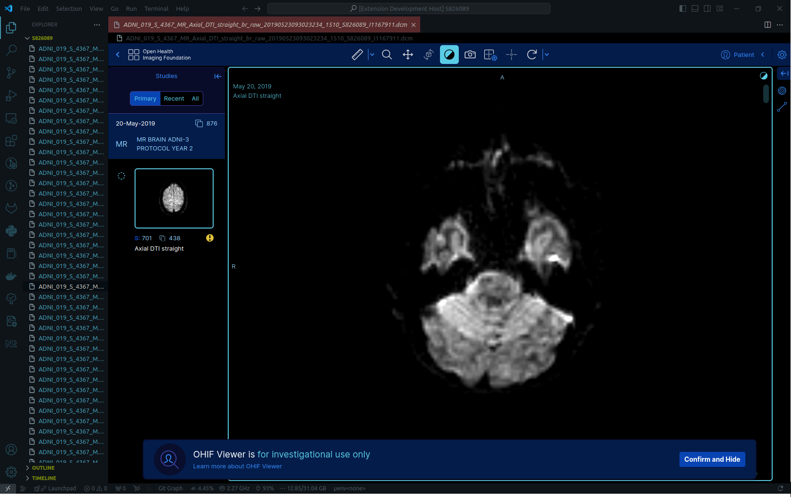

<h1>OHIF Viewer</h1>
Display DICOM files using OHIF Viewer in Visual Studio Code.
Click on any *.dcm file and OHIF Viewer will display corresponding series.

```
ext install kubzoey95.ohif-viewer
```

